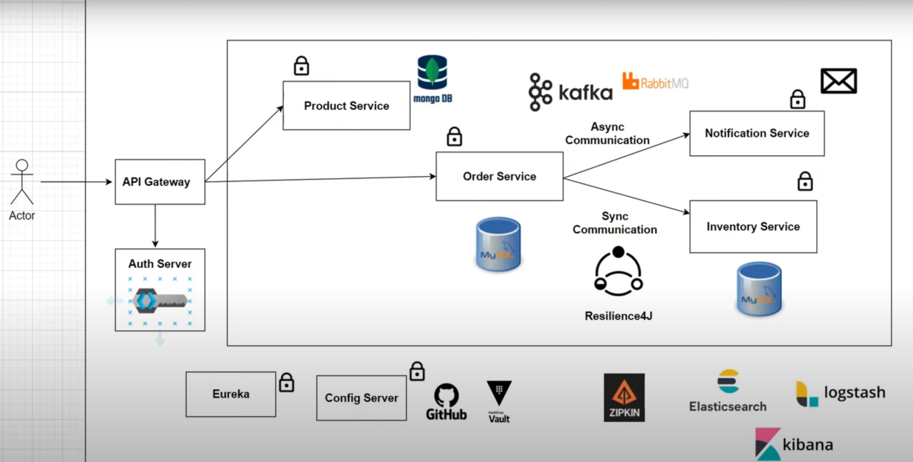
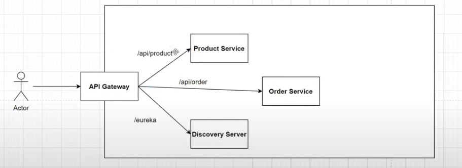
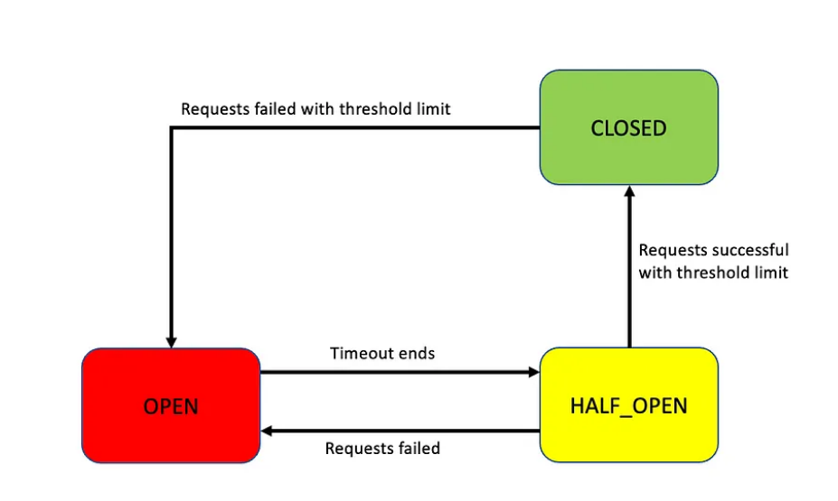

# SpringBootMicroservice Full Architecture Project

**Services we are going to build:-** 
**1 Product Service** - Create and View Products , act as Product Catalog  
**2 Order Service** - Can Order Products  
**3 Inventory Service** - Can check if products are in stock 
**4 Notification Service** - Can send Notification , after order is placed 
**5** Order,Inventory and Notification are going to interact with each other 
**6** Synchronous and Asynchronous Communication  

Architecture Diagram - 

InterProcess Communication - This can be achieved by RestTemplate/Webclient. From Spring 5 onwards RestTemplate is under maintenance and WebClient has more modern APIs compartively.
It can be achieved in two ways:- 
1. Synchronous Communication - One service will make request to another service and will wait for the response.
2. Asynchronous Communication - Fire and forget when service make a request and doesn't care of response.

To Use WebClient we need dependency
`<dependency>
<groupId>org.springframework.boot</groupId>
<artifactId>spring-boot-starter-webflux</artifactId>
</dependency>`

And then we will configure inside WebClientConfiguration where we will create bean of WebClient and class will be configured with
@Configuration annotation so that it can be scanned by ComponentScan and bean can be handle by Spring IOC Container

By Default webclient make all request as asynchronous. To make it as synchronous you have append with ".block()"
`webclient.get()
         .uri("URL")   
        .retrieve()
        .bodyToMono(ReturnResponseTypeFromRequestedUrl)
        .block();`
        

**SERVICE DISCOVERY**
The place where all the services will be at one place. and will be registered to discovery server
All request will go through discovery server and than redirected to respective target service.
By this we will avoid hardcoding any url and port number and can use application name in URI to request any service.
Also it will loadbalanced itself by just using `@LoadBalanced` to your webclient if you have multiple instance running on server 
 
_we need to add dependency :-_
Eureka server which is part of spring-cloud-netflix
and this server should run on standard port number - **8761**
 
 
**NOTE : **
To run various instance of any microservice we should not restrict port to specific so we can set `server.port = 0 `so that at runtime it will pick random portnumber based on availability
To run multiple instances change port to 0 and in edit configuration select-> allow multiple instance.
If we stop discovery service and rest other services are still Up than still our APIs will work as it will have internal copy of server running in client

 
 
**API GATEWAY- SPRING CLOUD GATEWAY**
 
API GATEWAY - which acts like entry point and will route  to respected service based on the rules configured. 
**DEFAULT PORT -  9191**
 
- Routing based on Request Header 
- Authentication 
- Security 
- Load Balancing 

**Features of SPRING CLOUD GATEWAY**  
- Able to match routes on any request attributes
- predicates and filters are specific to routes
- Circuit breaker Integration
- Spring cloud discovery client integration
- Request Rate Limiting
- Easy to write predicates and filters
- Path rewriting

 
Dependency used :-

  ` <dependency>
        <groupId>org.springframework.cloud</groupId>
        <artifactId>spring-cloud-starter-gateway</artifactId>
    </dependency>`

 
 
Route - basic build block of API GATEWAY. Its is defined by an ID,destination URI, collection of predicates, and a collection of filters.A route is matched if the aggregate predicate is true
 
Predicate - This is a java 8  function predicate . This let you match on anything from the HTTP request  such as headers or parameters  
Filter - These are the instances of Gateway Filter  that have been constructed with a specific factory. Here you can modify requests and responses before or after sending the downstream request. 
 
**Note**:- We should not implement security logic in gateway as it will break the basic architecture flow of GATEWAY. Instead we should create new microservice which will take care of all authentication and validation
and return to Gateway whether to route successfully to target or return exception to client.
 

**SPRING SECURITY**
Authentication and authorization are critical components of microservice security. Use Spring Security to implement these functionalities to ensure that only authorized users or services can access your microservices.
 

PasswordEncoder - Is used to encrypt the password while saving in DB  
JWT HELPER - we will create helper component to handle JWT(Json Web Token) Validation, Creation.  
**Dependency used to access jwt** -  
<!--JWT-->
`<dependency>
    <groupId>io.jsonwebtoken</groupId>
    <artifactId>jjwt-api</artifactId>
    <version>0.11.5</version>
</dependency>`
 

`<dependency>
    <groupId>io.jsonwebtoken</groupId>
    <artifactId>jjwt-impl</artifactId>
    <version>0.11.5</version>
    <scope>runtime</scope>
</dependency>`
 

`<dependency>
    <groupId>io.jsonwebtoken</groupId>
    <artifactId>jjwt-jackson</artifactId>
    <version>0.11.5</version>
    <scope>runtime</scope>
</dependency>`
 

Secret of 32 bit
generate a token
to create a token these are params required -
- claims ( header, payload and signature)
- set subject -  username
- issued at -- current time timestamp
- expiration -- current time +timestamp
- sign with - type of algo using to encrypt token

Spring Security - It uses UserDetailsService to load user information by using loadUserByUserName method
Also it will be required to generate token and to validate token

**Steps to implement jwt token:**

1) Make sure spring-boot-starter-security is there in pom.xml
2) Create Class JWTAthenticationEntryPoint that implement AuthenticationEntryPoint. Method of this class is called whenever as exception is thrown due to unauthenticated user trying to access the resource that required authentication.
3) Create JwtHelper  class ,This class contains method related to perform operations with jwt token like generateToken, validateToken etc.
4) Create JWTAuthenticationFilter that extends OncePerRequestFilter and override method and write the logic to check the token that is comming in header. We have to write 5 important logic
- Get Token from request
- Validate Token
- GetUsername from token
- Load user associated with this token
- set authentication
5) Configure spring security filter chain in AuthConfig file

**GATEWAY FILTER** -
 
Create a Pre Filter: Implement a pre filter to intercept incoming requests and validate the token.
 
Add Filter in your application.yml to all the routes and do not include in the Auth-security-service.

**CIRCUIT BREAKER**
 
1) Closed State - When microservices run and interact smoothly, circuit breaker is Closed. It keeps continuously monitoring the number of failures occurring within the configured time period. If the failure rate exceeds the specified threshold, Its state will change to Open state. If not, it will reset the failure count and timeout period.
2) Open State - During Open state, circuit breaker will block the interacting flow between microservices. Request callings will fail, and exceptions will be thrown. Open state remains until the timeout ends, then change to Half_Open state.
3) Half Open - In Half_Open state, circuit breaker will allow a limited of number requests to pass through. If the failure rate is greater than the specified threshold, it switches again to Open state. Otherwise, it is Closed state.

- Dependency Used  
`
<dependency>
      <groupId>org.springframework.cloud</groupId>
      <artifactId>spring-cloud-starter-circuitbreaker-resilience4j</artifactId>
</dependency>
`
@CircuitBreaker(name = "anyname" , fallbackMethod= "method_name")
It can be in service or controller where you are making a call